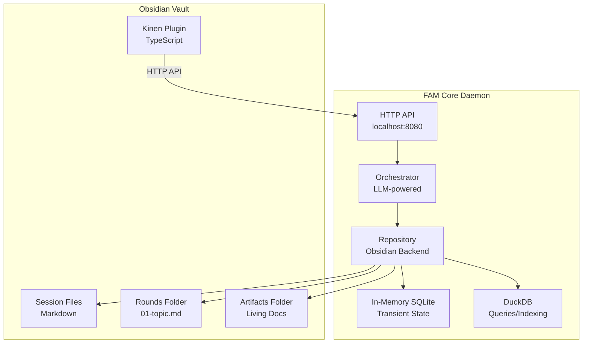

# Kinen Obsidian Plugin POC - Complete Specification

**Version**: POC 1.0  
**Status**: Ready for Implementation  
**Date**: 2025-11-12

---

## Overview

This specification defines the complete architecture and implementation plan for the Kinen Obsidian Plugin POC, integrating with FAM/Kinen to provide native Obsidian support for kinen sessions.

**POC Goal**: Validate end-to-end workflow entirely within Obsidian, with no context switching required.

---

## Architecture



---

## Component Specifications

### 1. Kinen Obsidian Plugin (TypeScript)

**Location**: `obsidian-kinen-plugin/`  
**Technology**: TypeScript, Obsidian Plugin API  
**Dependencies**: None (core Obsidian API only)

#### Core Features

**1.1 Session Management**
- **Command**: `Kinen: Create New Session`
- **Modal Form**:
  - Session name (text input)
  - Session type (dropdown: iterative-design, technical-spec, creative-writing, etc.)
  - Domain tag (dropdown: domain/architecture, domain/product-design, etc.)
  - Goals (textarea, multi-line)
  - Success criteria (textarea, multi-line)
  - Key documents (optional, textarea)
- **Action**: Calls FAM API → Creates folder structure → Generates `init.md` from template → Opens file

**1.2 Round Interaction**
- **Pre-populate Callouts**: When FAM generates round, plugin ensures empty `> [!note] Answer` blocks exist
- **Insert Callout Command**: `Kinen: Insert Response Callout` - Inserts callout at cursor
- **Status Bar Button**: "Ready for Round N" - Triggers next round generation
- **Command**: `Kinen: Mark Round Complete` - Updates metadata, triggers FAM

**1.3 AI Integration**
- **Status Bar Button**: "Generate Next Round" - Calls FAM API, shows progress
- **Command**: `Kinen: Suggest Links` - Calls FAM semantic search API, inserts links
- **Command**: `Kinen: Extract Decisions` - Calls FAM API, updates living documents
- **Progress Indicator**: Shows "AI is preparing Round N..." when processing

**1.4 Dashboard Generation**
- **Command**: `Kinen: Generate Dashboard` - Creates/updates `artifacts/dashboard.md`
- **Content**: Progress, decisions, open questions, related sessions
- **Auto-update**: Can be triggered manually or on round completion

#### Plugin API Usage

```typescript
// Example: Create session
const response = await fetch('http://localhost:8080/api/sessions', {
  method: 'POST',
  headers: { 'Content-Type': 'application/json' },
  body: JSON.stringify({
    name: sessionName,
    type: sessionType,
    domain_tag: domainTag,
    goals: goals.split('\n'),
    success_criteria: successCriteria.split('\n'),
    vault_path: app.vault.adapter.basePath
  })
});

const session = await response.json();
// Create folder structure, generate init.md, open file
```

#### Settings

```typescript
interface KinenPluginSettings {
  famApiUrl: string; // Default: http://localhost:8080
  autoGenerateCallouts: boolean; // Default: true
  showStatusBarButton: boolean; // Default: true
  defaultSessionType: string; // Default: iterative-design
}
```

---

### 2. FAM Core Daemon (Go)

**Location**: `fam-obsidian-backend/`  
**Technology**: Go, HTTP server, SQLite, DuckDB  
**Dependencies**: FAM core, LLM client

#### HTTP API Server

**Port**: 8080 (configurable)  
**Protocol**: HTTP REST + SSE for real-time updates  
**Authentication**: None (localhost only)

#### API Endpoints

**Base URL**: `http://localhost:8080/api`

**Session Management**:
```
POST   /sessions              - Create new session
GET    /sessions              - List sessions (with filters)
GET    /sessions/:id          - Get session details
PATCH  /sessions/:id          - Update session metadata
DELETE /sessions/:id          - Delete session (with confirmation)
```

**Round Management**:
```
POST   /sessions/:id/rounds           - Generate next round
GET    /sessions/:id/rounds            - List rounds
GET    /sessions/:id/rounds/:num       - Get round details
POST   /sessions/:id/rounds/:num/complete - Mark round complete
```

**Link & Search**:
```
GET    /sessions/:id/links             - Suggest links for current round
POST   /search/semantic                - Semantic search across vault
GET    /sessions/:id/related           - Find related sessions
```

**Dashboard**:
```
GET    /sessions/:id/dashboard         - Generate dashboard content
```

**Health**:
```
GET    /health                         - Health check
GET    /status                         - FAM daemon status
```

#### Request/Response Examples

**Create Session**:
```json
POST /api/sessions
{
  "name": "My Session",
  "type": "iterative-design",
  "domain_tag": "domain/architecture",
  "goals": ["Goal 1", "Goal 2"],
  "success_criteria": ["Criteria 1"],
  "vault_path": "/path/to/vault"
}

Response:
{
  "session_id": "sess-001",
  "session_path": "sessions/20251112-01-my-session",
  "init_file": "sessions/20251112-01-my-session/init.md",
  "status": "created"
}
```

**Generate Next Round**:
```json
POST /api/sessions/sess-001/rounds
{
  "methodology": "iterative-design",
  "context": {
    "previous_rounds": ["rounds/01-topic.md", "rounds/02-topic.md"],
    "session_goals": ["Goal 1", "Goal 2"],
    "decisions_made": ["Decision 1", "Decision 2"],
    "open_questions": ["Question 1"]
  }
}

Response:
{
  "round_number": 3,
  "round_file": "rounds/03-concrete-proposals.md",
  "status": "generated",
  "suggested_links": [
    {
      "text": "similar topic",
      "target": "sessions/20251111-01-other/rounds/01-topic.md",
      "reason": "Discussed similar concept"
    }
  ]
}
```

---

### 3. Repository Layer (Obsidian Backend)

**Responsibility**: Read/write Obsidian vault files, manage state

#### File Operations

**Read Session**:
- Read `init.md` → Parse frontmatter → Extract session metadata
- Read `rounds/*.md` → Parse frontmatter → Extract round metadata
- Read `artifacts/*.md` → Extract decisions, open questions

**Write Session**:
- Create folder structure
- Generate `init.md` from template
- Generate round files with pre-populated callouts
- Update frontmatter metadata

**State Management**:
- Encode turn execution state in frontmatter
- Update `fam_status`, `fam_current_round`, `fam_last_turn` in `init.md`
- Update `fam_status`, `fam_completed_at` in round files

#### Metadata Schema

**Session Metadata** (`init.md` frontmatter):
```yaml
---
date: 2025-11-12T11:20:32Z
artifact_type: session_init
aliases:
  - "session-name - Session Initialization"
tags:
  - space/p
  - domain/architecture
  - type/iterative-design
  - status/in-progress
fam_session_id: sess-001
fam_status: in-progress
fam_current_round: 3
fam_last_turn: 2025-11-12T11:20:32Z
summary: "Session description"
---
```

**Round Metadata** (`rounds/03-topic.md` frontmatter):
```yaml
---
date: 2025-11-12T11:20:32Z
artifact_type: round_exploration
aliases:
  - "session-name - Topic Name"
  - "session-name - Round 3"
tags:
  - space/p
  - round-03
fam_round_number: 3
fam_status: complete
fam_completed_at: 2025-11-12T11:20:32Z
summary: "Round description"
---
```

---

### 4. Orchestrator (LLM-powered)

**Responsibility**: Generate rounds, suggest links, extract decisions

#### Round Generation

**Input**:
- Previous rounds (file paths)
- Session goals and success criteria
- Decisions made so far
- Open questions
- Methodology template

**Process**:
1. Read previous rounds
2. Extract user responses from callouts
3. Analyze progress against goals
4. Generate next round questions using LLM
5. Pre-populate callout blocks
6. Suggest links to related sessions
7. Write round file

**Output**:
- Round file with questions and pre-populated callouts
- Suggested links
- Updated session metadata

#### Link Suggestion

**Process**:
1. Extract key concepts from current round
2. Use semantic search to find related sessions
3. Rank by relevance
4. Return top N suggestions with context

#### Decision Extraction

**Process**:
1. Read completed rounds
2. Identify decision points (explicit or implicit)
3. Extract decision text and rationale
4. Update living documents (`integration-plan.md`, `requirements.md`, etc.)

---

### 5. Storage Architecture

#### Obsidian Vault (Primary Storage)

**Structure**:
```
vault/
  sessions/
    20251112-01-session-name/
      init.md
      rounds/
        01-topic-name.md
        02-next-topic.md
      artifacts/
        integration-plan.md
        dashboard.md
  .fam/
    temp/
      fam-state.db          # Checkpointed SQLite state
    duckdb/
      fam.db                # DuckDB for queries
```

**File Format**: Markdown with YAML frontmatter  
**Version Control**: User's choice (Git, iCloud, etc.)

#### In-Memory SQLite (Transient State)

**Purpose**: Agent execution state, turn tracking  
**Lifetime**: Runtime only  
**Checkpointing**: Saved to `.fam/temp/` on graceful shutdown  
**Rehydration**: Rebuilt from vault files on startup

**Schema** (simplified):
```sql
CREATE TABLE sessions (
  id TEXT PRIMARY KEY,
  name TEXT,
  status TEXT,
  current_round INTEGER,
  vault_path TEXT
);

CREATE TABLE turns (
  id TEXT PRIMARY KEY,
  session_id TEXT,
  round_number INTEGER,
  status TEXT,
  started_at TIMESTAMP,
  completed_at TIMESTAMP
);
```

#### DuckDB (Queries/Indexing)

**Purpose**: Semantic search embeddings, cross-session queries  
**Location**: `.fam/duckdb/fam.db`  
**Format**: File-based, portable

**Usage**:
- Store embeddings for semantic search
- Query sessions by tags, status, date
- Cross-session analysis
- Analytics and insights

---

## Implementation Phases

### Phase 1: Foundation (Week 1-2)

**FAM Backend**:
- [ ] HTTP API server (Go)
- [ ] Basic session CRUD operations
- [ ] File read/write operations for Obsidian vault
- [ ] Frontmatter parsing and generation
- [ ] In-memory SQLite for transient state

**Plugin**:
- [ ] Basic plugin structure (TypeScript)
- [ ] Settings panel
- [ ] Command: Create Session (modal form)
- [ ] Command: List Sessions
- [ ] Basic file operations

**Integration**:
- [ ] Plugin → FAM API communication
- [ ] Error handling (FAM not running, API errors)
- [ ] Health check

**Deliverable**: Can create sessions, list sessions, basic file operations work

---

### Phase 2: Round Generation (Week 2-3)

**FAM Backend**:
- [ ] Orchestrator integration (LLM client)
- [ ] Round generation logic
- [ ] Callout pre-population
- [ ] Template system integration
- [ ] Metadata update logic

**Plugin**:
- [ ] Status bar button: "Generate Next Round"
- [ ] Command: "Kinen: Generate Next Round"
- [ ] Progress indicator
- [ ] Auto-open generated round file
- [ ] Callout insertion command

**Integration**:
- [ ] Round generation workflow end-to-end
- [ ] Metadata synchronization
- [ ] Error handling and retry logic

**Deliverable**: Can generate rounds, pre-populate callouts, workflow works

---

### Phase 3: Enhanced Features (Week 3-4)

**FAM Backend**:
- [ ] Semantic search (embeddings + DuckDB)
- [ ] Link suggestion logic
- [ ] Decision extraction
- [ ] Dashboard generation
- [ ] Cross-session analysis

**Plugin**:
- [ ] Command: "Kinen: Suggest Links"
- [ ] Command: "Kinen: Extract Decisions"
- [ ] Command: "Kinen: Generate Dashboard"
- [ ] Link insertion UI
- [ ] Dashboard view

**Integration**:
- [ ] Semantic search workflow
- [ ] Link suggestion workflow
- [ ] Dashboard auto-update

**Deliverable**: Full feature set working, ready for POC testing

---

## POC Testing Plan

### Test Scenarios

**Scenario 1: Session Creation**
1. User clicks "Kinen: Create New Session"
2. Fills form (name, type, goals, etc.)
3. Clicks "Create"
4. **Expected**: Folder structure created, `init.md` generated, file opens

**Scenario 2: Round Generation**
1. User reviews Round 1
2. Adds responses in callouts
3. Clicks "Ready for Round 2" button
4. **Expected**: Round 2 generated, callouts pre-populated, file opens

**Scenario 3: Link Suggestion**
1. User clicks "Suggest Links" in Round 2
2. **Expected**: Links inserted to related sessions/concepts

**Scenario 4: Cross-Session Discovery**
1. User searches semantically: "Sessions about architecture"
2. **Expected**: Related sessions found and displayed

**Scenario 5: No Context Switching**
1. User completes entire workflow in Obsidian
2. **Expected**: Never needs to switch to Cursor/IDE

### Success Criteria

- ✅ Can create session entirely within Obsidian
- ✅ Can generate rounds without leaving Obsidian
- ✅ Callouts pre-populated and easy to use
- ✅ Links and tags work as expected
- ✅ No context switching required
- ✅ Non-technical user can use (test with wife)
- ✅ Daily use feels natural

---

## Error Handling

### FAM Not Running
- Plugin detects connection failure
- Shows error: "FAM daemon not running"
- Button: "Start FAM" (if FAM installed)
- Instructions: How to start FAM daemon

### API Errors
- User-friendly error messages
- Retry logic for transient errors
- Log errors for debugging
- Fallback behavior when possible

### File Conflicts
- Detect concurrent edits
- Show conflict resolution UI
- Merge strategies for frontmatter
- Warn before overwriting

---

## Security Considerations

- **Localhost Only**: HTTP API only accessible on localhost
- **No External Network**: No external API calls without user consent
- **File Scoping**: Plugin only accesses vault files
- **User Confirmation**: Destructive operations require confirmation
- **No Sensitive Data**: No API keys or secrets stored in plugin

---

## Performance Considerations

- **Large Vaults**: Efficient scanning and indexing
- **Semantic Search**: Background indexing, incremental updates
- **Round Generation**: Async processing with progress indicators
- **File Operations**: Batch operations where possible

---

## Testing Strategy

### Unit Tests
- Plugin functions (file operations, API calls)
- FAM API handlers
- Frontmatter parsing/generation
- Template processing

### Integration Tests
- Plugin ↔ FAM API communication
- Round generation workflow
- File operations end-to-end
- Error scenarios

### End-to-End Tests
- Complete session workflow
- Multiple sessions
- Cross-session linking
- Semantic search

### User Acceptance Testing
- Test with non-technical user (wife)
- Test creative writing use case
- Test technical specification use case
- Gather feedback and iterate

---

## Deployment

### FAM Daemon
- **Installation**: Binary distribution or package manager
- **Configuration**: Vault path, API port, LLM API keys
- **Startup**: Can run as service or manually
- **Health Check**: `/api/health` endpoint

### Obsidian Plugin
- **Distribution**: Obsidian Community Plugins
- **Installation**: Standard plugin installation
- **Configuration**: Settings panel in Obsidian
- **Updates**: Standard plugin update mechanism

---

## Next Steps

1. **Set up development environment**
2. **Implement Phase 1** (Foundation)
3. **Test basic workflow**
4. **Implement Phase 2** (Round Generation)
5. **Test round generation**
6. **Implement Phase 3** (Enhanced Features)
7. **POC testing with real sessions**
8. **Iterate based on feedback**

---

_This specification is complete and ready for implementation. All architectural decisions are made, APIs are defined, and implementation phases are clear._

