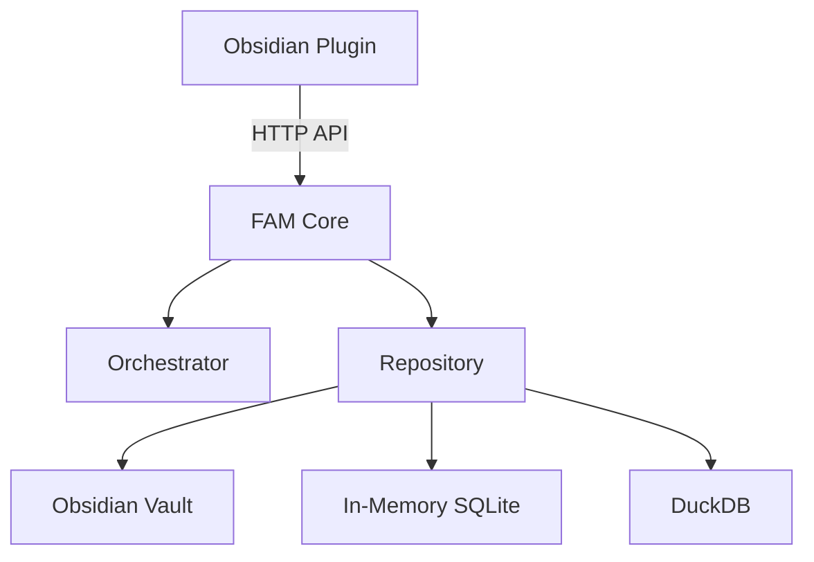
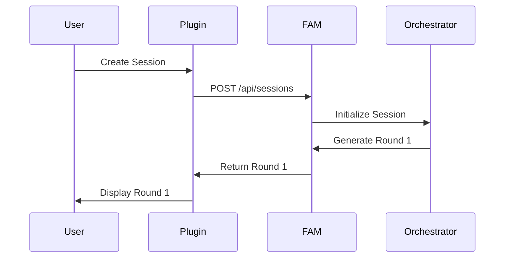

# Round 4: Concrete Deliverables & Final Recommendations

> [!success] Building on Round 3
> This round delivers concrete artifacts based on your Round 3 feedback: tag glossary, session templates, plugin integration spec, diagram recommendations, snippets setup, and session init UX exploration.

---

## 1. Tag Glossary Document

> [!tip] Tag System
> Created comprehensive tag glossary based on your sessions and methodology.

See: `tag-glossary.md` (created in artifacts folder)

**Key Categories**:
- **Domain Tags**: `#architecture`, `#product-design`, `#research`, `#creative-writing`, `#code-implementation`, `#business-strategy`
- **Session Type Tags**: `#iterative-design`, `#requirements-refinement`, `#research-design`, `#phased-analysis`, `#simple-task`, `#creative-writing`
- **Status Tags**: `#in-progress`, `#complete`, `#paused`, `#blocked`
- **Stakeholder Tags**: `#backend`, `#frontend`, `#product`, `#design`
- **Technology Tags**: `#go`, `#typescript`, `#datahub`, `#obsidian`

**Usage Guidelines**:
- Use 2-4 tags per session
- Always include at least one Domain tag
- Include Session Type tag
- Add Status tag when session state changes

**Q4.1**: Review the tag glossary - any additions or changes needed?

>[!NOTE] Answer
> maybe let's use conventional prefixes for the tag category ?

---

## 2. Session Templates

> [!important] Template Patterns
> Extracted templates from your existing sessions and created type-specific templates.

### Template Patterns Found

**Common Structure**:
- Frontmatter with date, artifact_type, tags, summary
- Session Goals (numbered list)
- Success Criteria (checkboxes)
- Context/Constraints section
- Key Documents/References
- Session Structure (round progression)

**Session Types Identified**:
1. **Iterative Design** (most common) - Round-based refinement
2. **Technical Specification** - Architecture/implementation focus
3. **Requirements Refinement** - Product requirements gathering
4. **Research + Design** - Research followed by design
5. **Architecture Review** - System architecture analysis
6. **Creative Writing** - Story/creative work

### Templates Created

See: `session-templates/` folder (created in artifacts)

**Templates**:
- `iterative-design-init.md` - Standard round-based sessions
- `technical-spec-init.md` - Technical architecture sessions
- `requirements-refinement-init.md` - Product requirements sessions
- `research-design-init.md` - Research + design sessions
- `architecture-review-init.md` - Architecture review sessions
- `creative-writing-init.md` - Creative writing sessions

**Template Variables**:
- `{{date}}` - Current date
- `{{session_name}}` - Session name (prompted)
- `{{goals}}` - Session goals (prompted)
- `{{success_criteria}}` - Success criteria (prompted)
- `{{domain_tag}}` - Domain tag (prompted)
- `{{key_documents}}` - Key documents (prompted)

**Q4.2**: Review templates - do they match your session patterns? Any adjustments needed?

> [!note] Answer
>Looks like a good start. I would maybe change the terminology to mirror famkinen and user "turns" instead of "rounds" ? what do you think, you are allowed to challenge this idea (as always).

---

## 3. Plugin + FAM/Kinen Integration Spec

> [!important] Integration Architecture
> Detailed specification for Obsidian plugin + FAM/Kinen integration.

See: `plugin-integration-spec.md` (created in artifacts)

### Architecture Overview

```
┌─────────────────────────────────────────────────────────┐
│              Obsidian Vault (Kinen Sessions)            │
│                                                          │
│  ┌──────────────────────────────────────────────────┐  │
│  │      Kinen Obsidian Plugin (TypeScript)          │  │
│  │  - Session management UI                          │  │
│  │  - Round creation/editing                         │  │
│  │  - Callout helpers                                │  │
│  │  - Dashboard generation                           │  │
│  │  - Status bar integration                         │  │
│  └───────────────────┬──────────────────────────────┘  │
│                      │ HTTP API (localhost)              │
└──────────────────────┼──────────────────────────────────┘
                       │
                       ▼
┌─────────────────────────────────────────────────────────┐
│           FAM Core Daemon (Go)                          │
│                                                          │
│  ┌──────────────────────────────────────────────────┐  │
│  │         Orchestrator (LLM-powered)               │  │
│  │  - Creates rounds based on methodology            │  │
│  │  - Suggests links to related sessions             │  │
│  │  - Extracts decisions from rounds                 │  │
│  │  - Generates cross-session insights               │  │
│  │  - Semantic search orchestration                  │  │
│  └───────────────────┬──────────────────────────────┘  │
│                      │                                   │
│  ┌───────────────────▼──────────────────────────────┐  │
│  │    Repository (Obsidian Backend + In-Memory DB)   │  │
│  │  - Reads/writes Obsidian vault files               │  │
│  │  - In-memory SQLite for transient state            │  │
│  │  - DuckDB for queries/indexing                     │  │
│  │  - Checkpointing to temp folder                    │  │
│  └──────────────────────────────────────────────────┘  │
└─────────────────────────────────────────────────────────┘
```

### Key Design Decisions

**1. Vault = Workspace**:
- One Obsidian vault = one FAM workspace
- All kinen sessions live in vault
- FAM manages vault as primary storage

**2. Hybrid Storage**:
- **Obsidian Vault**: Session files, rounds, artifacts (markdown)
- **In-Memory SQLite**: Transient agent execution state
- **DuckDB**: Queries, indexing, semantic search embeddings
- **Checkpointing**: Temp folder for DB state (graceful restart)

**3. Rehydration**:
- FAM can fully rehydrate from vault files
- Loss of DB state is not a problem (reconstruct from files)
- Turn execution state encoded in session file metadata

**4. Plugin API**:
- HTTP API on localhost (FAM daemon)
- REST endpoints for session operations
- WebSocket/SSE for real-time updates

### API Endpoints (Proposed)

```
POST   /api/sessions              - Create new session
GET    /api/sessions              - List sessions
GET    /api/sessions/:id          - Get session details
POST   /api/sessions/:id/rounds   - Generate next round
POST   /api/sessions/:id/complete - Mark round complete
GET    /api/sessions/:id/links    - Suggest links
POST   /api/search/semantic       - Semantic search
GET    /api/dashboard/:id         - Generate dashboard
```

**Q4.3**: Review the integration spec - does this architecture work? Any changes needed?

> [!note] Answer
> looks like a good start. I would like to actually do a POC in a follow up session and see how it feels.

---

## 4. Diagram Format Recommendations

> [!tip] Diagram Options
> Research on Obsidian Canvas vs Excalidraw vs Mermaid for technical diagrams.

### Comparison

| Feature | Obsidian Canvas | Excalidraw | Mermaid |
|---------|----------------|------------|---------|
| **Format** | `.canvas` (JSON) | `.excalidraw` (JSON) | Markdown code block |
| **Native Support** | ✅ Built-in | ❌ Plugin needed | ✅ Built-in |
| **Editing** | Visual canvas | Visual drawing | Text-based |
| **Best For** | Freeform layouts, mind maps | Hand-drawn style, diagrams | Flowcharts, sequence diagrams |
| **Technical Diagrams** | ⚠️ Possible but not ideal | ✅ Good for architecture | ✅ Excellent for flows |
| **Editable by AI** | ⚠️ Complex JSON | ⚠️ Complex JSON | ✅ Simple text |

### Recommendation: **Mermaid for Technical Diagrams**

**Why Mermaid**:
- ✅ Native Obsidian support (no plugin needed)
- ✅ Text-based (easy for AI to generate/edit)
- ✅ Excellent for flowcharts, sequence diagrams, architecture
- ✅ Version-control friendly (just markdown)
- ✅ Can be embedded in round files

**When to Use Each**:
- **Mermaid**: Technical architecture, flows, sequence diagrams, ER diagrams
- **Excalidraw**: Hand-drawn style, freeform diagrams, brainstorming
- **Canvas**: Mind maps, freeform layouts, visual organization

### Mermaid Examples

**Architecture Diagram**:


**Sequence Diagram**:


**Q4.4**: Does Mermaid work for your needs? Should I convert the architecture diagram to Mermaid?

> [!note] Answer
> yes that's perfect


---

## 5. Snippets Setup Guide

> [!tip] Snippets Configuration
> Guide for setting up Obsidian snippets for callout shortcuts.

### Obsidian Snippets

Snippets are text expansions stored in `.obsidian/snippets/` folder.

### Setup Steps

1. **Create Snippets Folder**:
   ```
   .obsidian/snippets/
   ```

2. **Create Snippet Files**:
   - `callout-response.txt` - Response callout
   - `callout-question.txt` - Question callout
   - `callout-note.txt` - Note callout
   - `callout-tip.txt` - Tip callout

3. **Snippet Content**:

   **`callout-response.txt`**:
   ```
   > [!note] Answer
   >
   ```

   **`callout-question.txt`**:
   ```
   > [!question]
   >
   ```

   **`callout-tip.txt`**:
   ```
   > [!tip]
   >
   ```

4. **Enable Snippets**:
   - Settings → Core plugins → Snippets
   - Enable "Snippets" plugin
   - Snippets will expand when you type the filename

### Alternative: Templater Snippets

If using Templater plugin, can create snippets that expand with variables:

**`callout-response.template`**:
```
> [!note] Answer
> {{cursor}}
```

**Usage**: Type `:response` → expands to callout with cursor positioned

### Recommended Setup

**Option A: Native Snippets** (simpler)
- Use Obsidian's built-in snippets
- Type filename → expands

**Option B: Templater Snippets** (more powerful)
- Use Templater plugin
- Custom triggers (`:response`, `:question`, etc.)
- Can include variables

**Q4.5**: Which snippet approach do you prefer? Should I create the snippet files?

> [!note] Answer
> please create the snippets. Could our plugin bring more improvements (similar to what the Templater plugin does ?)

---

## 6. Session Init UX Exploration

> [!question] Session Creation Flow
> Exploring UX options for session initialization.

### Current Flow (Manual)

1. User creates folder
2. User creates `init.md`
3. User copies template
4. User fills in variables
5. User creates `round-01.md`

**Problems**: Too many manual steps, error-prone, not intuitive

### Proposed UX Options

**Option A: Command Palette Command**
- Command: "Kinen: Create New Session"
- Modal form appears:
  - Session name
  - Session type (dropdown)
  - Domain tag (dropdown)
  - Goals (textarea)
  - Success criteria (textarea)
- Click "Create" → generates folder structure + files

**Option B: Status Bar Button**
- Button: "New Session"
- Click → opens modal form
- Same as Option A

**Option C: Template Hotkey**
- Hotkey: `Cmd+N` (or custom)
- Opens template picker
- Select template → opens in new note
- Fill variables → plugin creates session structure

**Option D: Right-Click Context Menu**
- Right-click in file explorer
- "New Kinen Session"
- Opens modal form

### Recommended: Option A + Option D

**Primary**: Command Palette (discoverable, keyboard-friendly)
**Secondary**: Right-click context menu (intuitive for mouse users)

### Modal Form Design

```typescript
// Plugin modal form
class CreateSessionModal extends Modal {
  form: {
    sessionName: string
    sessionType: 'iterative-design' | 'technical-spec' | ...
    domainTag: string
    goals: string[]
    successCriteria: string[]
    keyDocuments?: string[]
  }

  onSubmit() {
    // Create folder structure
    // Generate init.md from template
    // Create rounds/ folder
    // Create artifacts/ folder
    // Open init.md
  }
}
```

### File Structure Generated

```
sessions/
  20251112-02-session-name/
    init.md              # Generated from template
    rounds/              # Empty folder
    artifacts/            # Empty folder
    integration-plan.md  # Optional living document
```

**Q4.6**: Does this UX work? Any improvements or different approaches?

> [!note] Answer
> yes let's try it in our POC I want to see how it feels, we can iterate later

---

## 7. File Naming with Aliases

> [!tip] Naming Convention
> Implementing Option C (numbered + descriptive) + aliases for better linking.

### Naming Convention

**Files**: `01-topic-name.md`, `02-next-topic.md`
**Aliases**: Set in frontmatter for better link display

### Example Round File

```markdown
---
date: 2025-11-12
artifact_type: round_exploration
tags: [round-04, obsidian]
  - space/p
aliases: ["Concrete Deliverables & Final Recommendations"]
summary: Concrete deliverables: tag glossary, session templates...
---

# Round 4: Concrete Deliverables & Final Recommendations
```

### Aliases in Obsidian

**Frontmatter**:
```yaml
aliases: ["Linking Conventions", "Round 1 - Linking"]
```

**Benefits**:
- Shows in link autocomplete
- Better display in graph view
- Can have multiple aliases
- Still maintains file name for sorting

### Link Display

When linking: `[[01-linking-conventions|Linking Conventions]]`
- File: `01-linking-conventions.md`
- Display: "Linking Conventions"

**Q4.7**: Does this naming + aliases approach work? Should I update existing rounds?

> [!note] Answer
> yes please update. I want to see how it feels

---

## 8. Updated Methodology Document

> [!important] Methodology Updates
> Updating kinen methodology with Obsidian-specific guidance.

### Key Additions

1. **File Naming**: Use `01-topic-name.md` format + aliases
2. **Linking Conventions**: Links for explicit relationships, tags for themes
3. **Callout Format**: Use `> [!note] Answer` for responses
4. **Templates**: Use session type templates for consistency
5. **Tag System**: Follow tag glossary for consistent tagging
6. **Diagram Format**: Use Mermaid for technical diagrams
7. **Session Init**: Use plugin command or right-click menu

See: `methodology-updates.md` (created in artifacts)

**Q4.8**: Review methodology updates - anything missing or incorrect?

> [!note] Answer
> sounds right

---

## Summary: Ready for Implementation

This round delivers:

1. ✅ **Tag Glossary** - Curated tag system with guidelines
2. ✅ **Session Templates** - 6 type-specific templates extracted from your sessions
3. ✅ **Plugin Integration Spec** - Detailed FAM/Kinen + Obsidian plugin architecture
4. ✅ **Diagram Recommendations** - Mermaid for technical, Excalidraw for freeform
5. ✅ **Snippets Setup** - Guide for callout shortcuts
6. ✅ **Session Init UX** - Command palette + context menu approach
7. ✅ **File Naming** - Numbered + descriptive + aliases
8. ✅ **Methodology Updates** - Obsidian-specific guidance

**Next Steps**:
- Review these deliverables
- Test templates and snippets
- Begin plugin development (if proceeding)
- Update existing sessions with new conventions (optional)

> [!info] Final Questions
> Are we ready to proceed with implementation? Any final adjustments needed before we wrap up this exploration session?

> [!note] Answer
>
