# Diagrams Reference

Guide for creating visual diagrams in kinen sessions.

## When to Use Diagrams

Diagrams are especially valuable in:
- **Architecture sessions**: System components and relationships
- **Integration sessions**: How parts connect
- **Complex flows**: User journeys, data flows, state machines

**Rule**: If you're explaining relationships between more than 3 things, consider a diagram.

## Mermaid (Primary)

Mermaid is the preferred format - native Obsidian support, text-based, version-control friendly.

### Flowcharts / Architecture

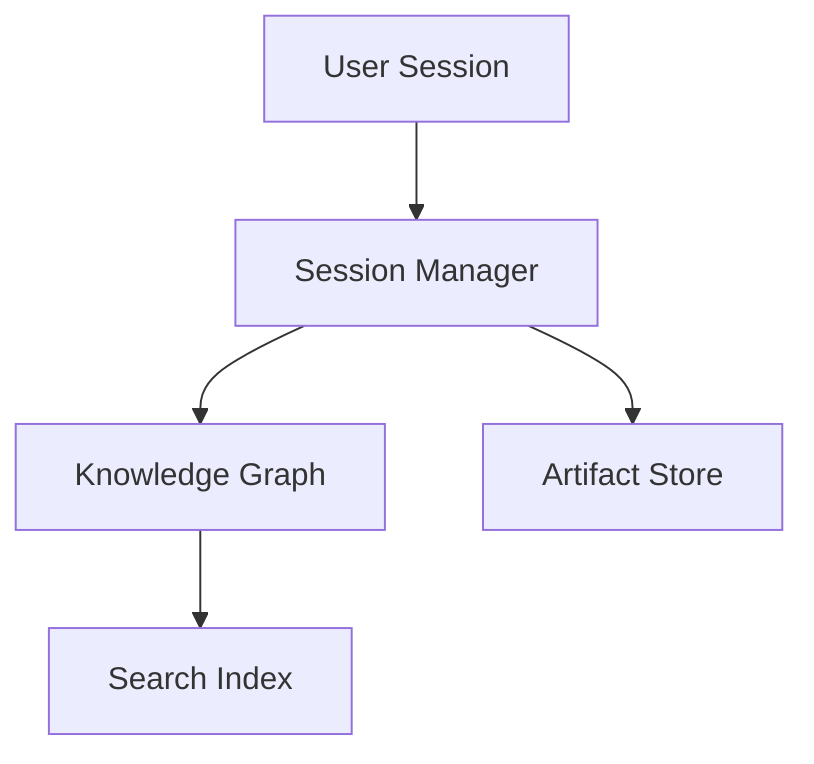

**Syntax:**
````markdown
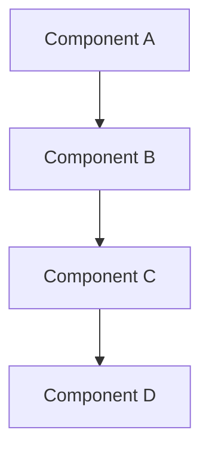
````

**Direction options:**
- `TB` - Top to bottom
- `BT` - Bottom to top
- `LR` - Left to right
- `RL` - Right to left

### Sequence Diagrams

Show interactions over time:

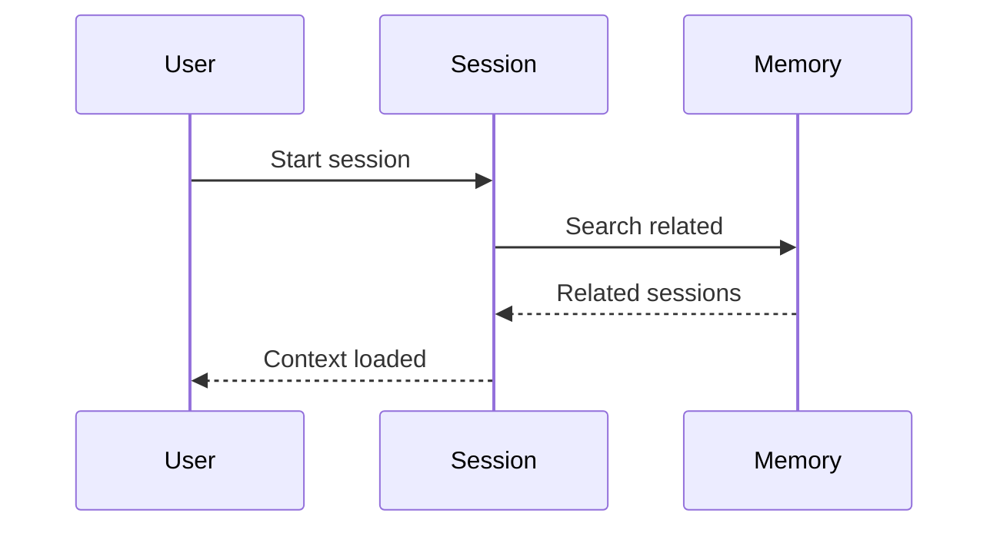

**Syntax:**
````markdown
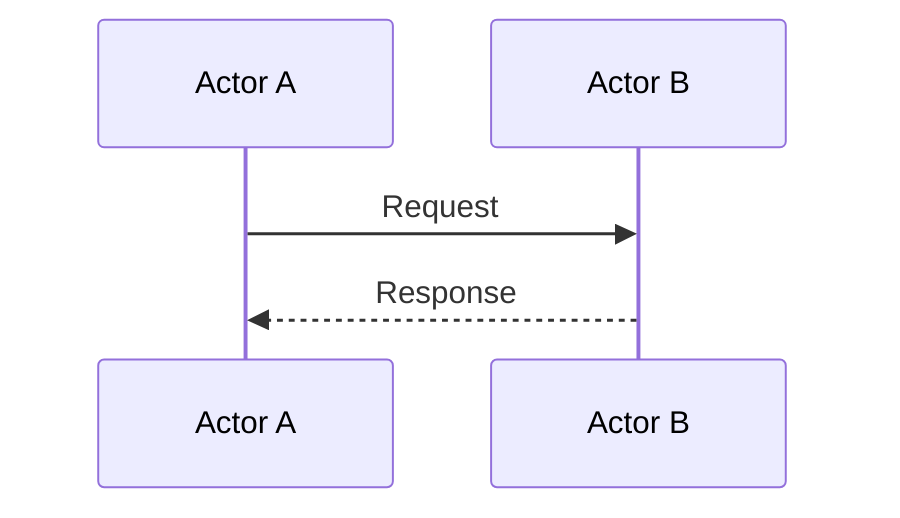
````

### State Diagrams

Show state machines and transitions:

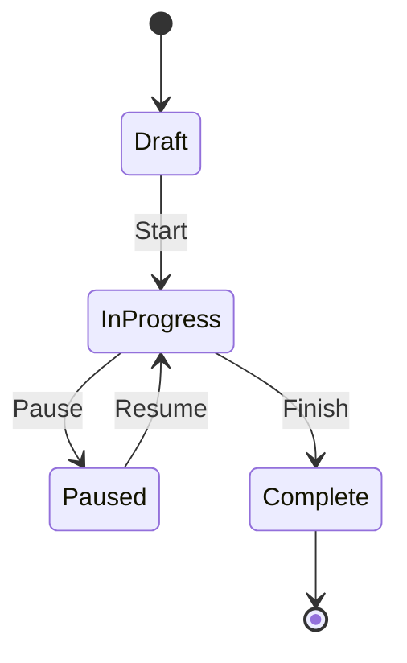

**Syntax:**
````markdown
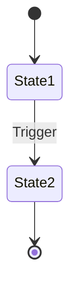
````

### Entity Relationship Diagrams

Show data models:

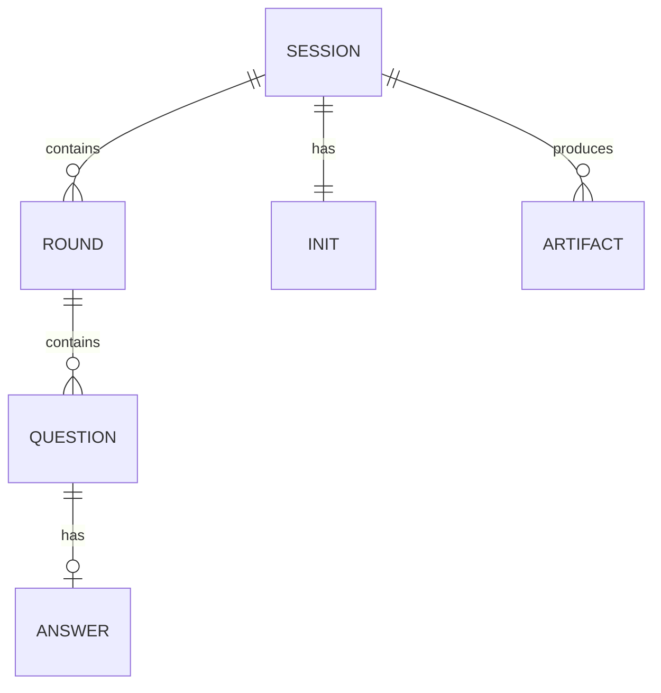

**Syntax:**
````markdown
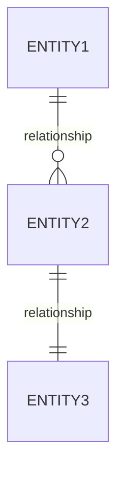
````

**Relationship notation:**
- `||--||` - One to one
- `||--o{` - One to many
- `o{--o{` - Many to many

### Class Diagrams

Show structure and relationships:

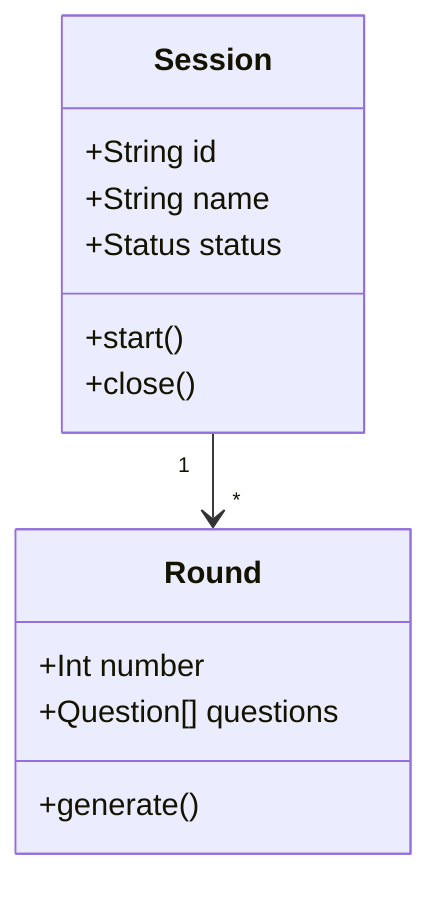

**Syntax:**
````markdown
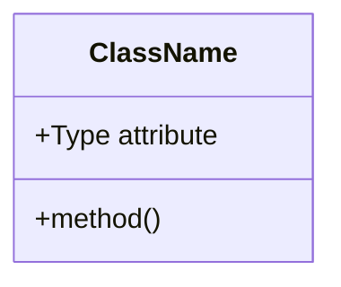
````

## Diagram Best Practices

### Do

- **Keep it simple**: 5-10 nodes maximum
- **Label clearly**: Use descriptive names
- **Show flow direction**: Make relationships clear
- **Use appropriate type**: Flowchart for architecture, sequence for interactions
- **Include in questions**: Diagrams help explain options
- **Design for print**: Diagrams should fit and be readable on A4/letter paper

### Don't

- **Overcrowd**: Split complex diagrams into multiple
- **Use colors excessively**: Obsidian themes vary
- **Forget context**: Always explain what the diagram shows
- **Make it the only explanation**: Diagrams supplement text
- **Use extreme horizontal layouts**: Wide `LR` diagrams don't print well - prefer `TB` (top-bottom) for complex flows

### In Round Questions

Use diagrams to clarify options:

```markdown
### Q2.3: Architecture Pattern

**Option A: Layered**

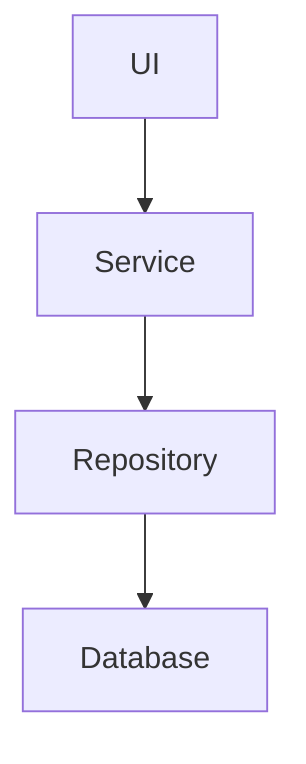

- Pros: Clear separation, testable
- Cons: Can be rigid

**Option B: Event-driven**

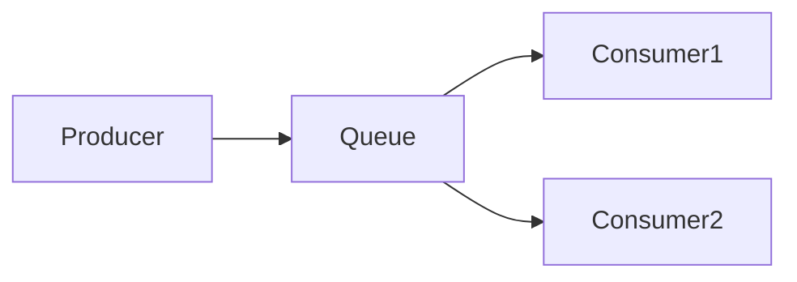

- Pros: Decoupled, scalable
- Cons: Complexity, debugging harder

> [!note] Answer
>
```

## Alternative Formats

### Excalidraw

For freeform, hand-drawn style diagrams:
- Brainstorming sessions
- Concept sketches
- Quick visual explanations

**Usage**: Create `.excalidraw` file in artifacts folder, link from documents.

### Obsidian Canvas

For spatial organization:
- Mind maps
- Relationship mapping
- Visual session overviews

**Usage**: Create `.canvas` file, useful for complex session navigation.

## Quick Reference

| Diagram Type | Use For | Mermaid Keyword |
|--------------|---------|-----------------|
| Flowchart | Architecture, processes | `graph` |
| Sequence | Interactions over time | `sequenceDiagram` |
| State | State machines | `stateDiagram-v2` |
| ER | Data models | `erDiagram` |
| Class | Object structure | `classDiagram` |

## Tips for AI Assistants

When generating diagrams:

1. **Match complexity to need**: Simple question → simple diagram
2. **Use consistent naming**: Match diagram labels to discussion terms
3. **Provide text explanation**: Diagram + explanation, not diagram alone
4. **Check rendering**: Mermaid syntax is strict, verify it renders
5. **Consider session type**: Architecture sessions need more diagrams than research
