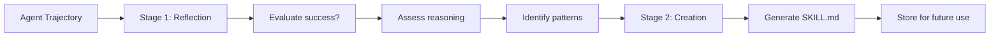
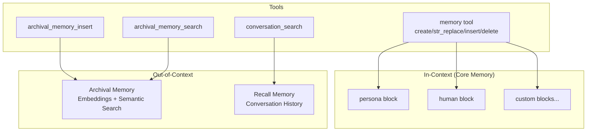

# Letta Analysis: Should We Use It Directly?

## Executive Summary

**Recommendation: Don't use Letta directly. Study Letta Code's skill system + research patterns.**

### Critical Discovery: Blog vs Product

| Component | Skills? | Automatic Learning? |
|-----------|---------|---------------------|
| **Letta Server** (`letta/`) | ❌ No | ❌ No |
| **Letta Code** (product) | ✅ Yes | ❌ No (human-in-the-loop) |
| **Letta Research** (blog) | ✅ Yes | ✅ Yes (evaluation only) |

**Key distinction**:
- The [Skill Learning blog](https://www.letta.com/blog/skill-learning) describes **research results** (36.8% improvement)
- The Letta Code product implements **human-in-the-loop skill creation** (`/skill` command)
- The automatic Reflection → Creation pipeline was used for **Terminal Bench evaluation**, not productionized

### What to Take from Each

**From Letta Code (Production Patterns)**:
- Three-tier skill hierarchy (bundled → global → project)
- Progressive disclosure (metadata → body → resources)
- AgentSkills.io-compatible `.skills/` structure
- Skill tool (load/unload/refresh)

**From Letta Research (Proven but Not Productionized)**:
- Two-stage learning: Reflection → Creation
- Trajectory + Feedback >> Trajectory alone
- 36.8% improvement benchmark

**Recommendation**: Build our own TypeScript implementation that combines:
1. Letta Code's file-based skill structure
2. Letta Research's automatic learning approach
3. llmchain's existing skill runtime and Bird integration

---

## NEW: Letta Code's Skill System

**Source**: [Skill Learning: Bringing Continual Learning to CLI Agents](https://www.letta.com/blog/skill-learning) + local codebase analysis at `/Users/sbellity/code/gh/agents-memory/letta-code`

### Critical Discovery: Two Different Systems!

After reviewing the Letta Code codebase, I found that **the blog describes research/evaluation results**, while **the actual product implements a different (human-in-the-loop) system**:

| Aspect | Blog (Research) | Letta Code (Product) |
|--------|-----------------|----------------------|
| **Trigger** | Automatic after trajectory | Manual `/skill` command |
| **Learning** | Agent analyzes own trajectory | Agent helps user create skill |
| **Process** | Reflection → Creation | `/skill` → Questions → SKILL.md |
| **Human role** | None (autonomous) | Collaborative design |

### What Letta Code Actually Implements

**1. Skill Discovery** (`src/agent/skills.ts`):
- Three-tier priority: `bundled` → `global (~/.letta/skills/)` → `project (.skills/)`
- Skills are directories with `SKILL.md` files
- Auto-discovered and loaded into `skills` memory block

**2. Skill Tool** (`src/tools/impl/Skill.ts`):
```typescript
interface SkillArgs {
  command: "load" | "unload" | "refresh";
  skills?: string[];  // Skill IDs to load/unload
}
```

**3. Skill Creation Mode** (`/skill` command):
```typescript
// From App.tsx - /skill triggers skill creation mode
if (trimmed.startsWith("/skill")) {
  // Extract optional description after /skill
  const [, ...rest] = trimmed.split(/\s+/);
  const description = rest.join(" ").trim();
  
  // Enter skill creation mode with SKILL_CREATOR_PROMPT
  const skillMessage = `<system-reminder>\n${SKILL_CREATOR_PROMPT}${userDescriptionLine}\n</system-reminder>`;
}
```

The skill creator prompt (`src/agent/prompts/skill_creator_mode.md`) guides the agent through:
1. Load `creating-skills` skill (if available)
2. Understand the requested skill
3. Ask clarifying questions (3-6 upfront)
4. Propose concrete skill design
5. Create/update skill files
6. Keep questions focused and iterative

### Skill File Structure (AgentSkills.io Compatible)

```
.skills/processing-pdfs/
├── SKILL.md              # Required: frontmatter + instructions
│   ├── name: string      # Required in frontmatter
│   └── description: string  # Required in frontmatter  
├── scripts/              # Optional: executable code
├── references/           # Optional: docs loaded as needed
└── assets/               # Optional: templates, images, etc.
```

### Progressive Disclosure (Key Pattern)

Three-level loading to manage context efficiently:

1. **Metadata** (~100 words) - Always in context
2. **SKILL.md body** (<5k words) - When skill triggers
3. **Bundled resources** (unlimited) - As needed by agent

### Two-Stage Learning (From Blog Research)

The blog describes a **research evaluation** that showed impressive results:



**Stage 1 - Reflection**:
- Evaluate whether the agent solved the task
- Assess logical soundness of reasoning
- Verify all steps are justified
- Identify repetitive patterns that could be abstracted

**Stage 2 - Creation**:
- Feed reflection to learning agent
- Generate skill with: potential approaches, common pitfalls, verification strategies

⚠️ **This is NOT implemented in the product codebase** - it was used for Terminal Bench evaluation.

### Results on Terminal Bench 2.0

| Setting | Performance | Cost | Tool Calls |
|---------|-------------|------|------------|
| **Baseline** (no skills) | - | - | - |
| **Skills (Trajectory only)** | +21.1% relative | -15.7% | -10.4% |
| **Skills (Trajectory + Feedback)** | +36.8% relative | - | - |

**Key insight**: Feedback-informed skills better encode failure modes and unsuccessful approaches, making them more robust.

### Memory Hierarchy

From the blog:
> "For Letta agents which support both skills and core memory, memory can be organized in a hierarchy:
> - **Core Memory / System Prompt Learning**: Evolved system prompt that applies across tasks, specific to agent's state
> - **Skills / Filesystem**: Evolving files for task-specific memory, designed to be interchangeable between agents"

### How to Use in Letta Code

```bash
# After interacting with your agent, call:
/skill
# Enters skill learning mode
```

### Why This Matters for Our Design

1. **Validates our approach**: Letta found 36.8% improvement - skill learning works
2. **Two-stage pattern**: Reflection → Creation is proven effective
3. **Feedback is critical**: Trajectory + feedback >> trajectory alone
4. **Portable skills**: `.md` files, AgentSkills.io compatible
5. **Memory hierarchy**: Core memory (agent-specific) + Skills (portable)

---

## What Letta Is

**Letta** (formerly MemGPT) is a platform for building stateful agents with advanced memory:

```
Version: 0.16.1
Language: Python 3.11+
Database: PostgreSQL (with SQLAlchemy + Alembic)
Dependencies: ~70+ packages (OpenAI, Anthropic, llama-index, MCP, etc.)
```

### Core Features

| Feature | Description |
|---------|-------------|
| **Memory Blocks** | In-context memory with labeled blocks (persona, human, custom) |
| **Archival Memory** | Long-term storage with embedding-based semantic search |
| **Recall Memory** | Conversation history search |
| **Block History** | Undo/redo for memory edits with sequence numbering |
| **Multi-Agent** | Supervisor, round-robin, and dynamic agent groups |
| **Tool Sandboxing** | E2B, Modal, local sandbox execution |
| **MCP Client** | Model Context Protocol integration |

---

## Letta's Memory Architecture

### Memory Types



### Memory Block Schema

From `letta/schemas/block.py`:

```python
class Block(BaseBlock):
    id: str
    value: str                    # The actual content
    limit: int                    # Character limit (default 2000)
    label: str                    # e.g., "persona", "human"
    description: str              # What this block is for
    read_only: bool              # Can agent edit?
    metadata: dict               # Additional data
    hidden: bool                 # Hide from agent?
```

### Block History (Undo/Redo)

Letta has sophisticated block versioning:

```python
class BlockHistory:
    block_id: str
    sequence_number: int          # Linear history
    description: str
    label: str
    value: str
    limit: int
    metadata_: dict
    actor_type: ActorType         # USER or AGENT
    actor_id: str
```

**Key insight**: Block edits are checkpointed, allowing undo/redo through sequence numbers.

---

## What Letta Does NOT Have

### No Skills Concept

```bash
$ grep -ri "skill" letta/
# 0 results
```

Letta has:
- ✅ Memory blocks (declarative memory)
- ✅ Archival memory (long-term facts)
- ✅ Tools (functions agents can call)
- ❌ **No skills** (procedural knowledge)
- ❌ **No skill learning** (learning from experience)
- ❌ **No AgentSkills.io support**

### Skill Learning Would Need to Be Built

To add skill learning to Letta, you would need to:
1. Define a new memory type for skills
2. Create skill extraction logic
3. Build skill discovery/activation tools
4. Implement skill learning from successful sessions

**This is exactly what we're designing for llmchain.**

---

## Comparison: Letta vs llmchain

| Aspect | Letta | llmchain |
|--------|-------|----------|
| **Language** | Python | TypeScript |
| **Runtime** | Standalone server | Embedded in Bird API |
| **Database** | PostgreSQL (own schema) | PostgreSQL (Bird schema) |
| **Auth** | Own user/org model | Bird workspace/user model |
| **Memory** | Blocks + Archival + Recall | Session context + Scratchpad |
| **Skills** | ❌ None | ✅ Two-tier static skills |
| **Tool Gating** | ❌ None | ✅ Skills unlock tools |
| **MCP** | ✅ Client support | ✅ Client support |
| **Multi-Agent** | ✅ Built-in | ✅ Router + Sub-agents |

### Integration Burden

To use Letta directly for llmchain:

| Task | Effort |
|------|--------|
| Rewrite llmchain in Python | **Massive** |
| Replace Bird API integration | **Massive** |
| Migrate workspace/user model | **Large** |
| Port existing skill system | **Large** |
| Integrate with existing memory package | **Large** |
| Maintain two platforms | **Ongoing** |

**Verdict**: Not practical.

---

## What We Can Learn From Letta

### 1. Memory Block Design

Letta's block model is elegant:

```python
# Each block has:
- label (identifier)
- value (content)
- limit (max chars)
- description (metadata)
- read_only (permissions)
```

**Applicable to skills**: Skills could be stored as structured blocks with similar metadata.

### 2. Block History / Versioning

Letta's checkpoint-based history:

```python
async def checkpoint_block_async(block_id, actor):
    # 1. Get current sequence
    # 2. Truncate future checkpoints (if undone)
    # 3. Create new history entry
    # 4. Update block's pointer to new entry
```

**Applicable to skills**: We could version learned skills similarly for evolution over time.

### 3. Archival Memory Pattern

```python
async def archival_memory_insert(content: str, tags: list[str]):
    """Store with semantic embeddings for later search"""
    
async def archival_memory_search(query: str, tags: list[str], top_k: int):
    """Search by semantic similarity"""
```

**Applicable to skills**: Skill discovery could use similar semantic search.

### 4. Memory Tool Design

The unified `memory` tool with subcommands:

```python
def memory(command: str, path: str, ...):
    if command == "create": ...
    elif command == "str_replace": ...
    elif command == "insert": ...
    elif command == "delete": ...
    elif command == "rename": ...
```

**Applicable to skills**: A unified `skills` tool could follow this pattern.

---

## Recommendation

### Do NOT Use Letta Server Directly

1. **Wrong fit** - Different language (Python), architecture, integration model
2. **No skill system in server** - Skills are in Letta Code, not Letta server
3. **Migration cost** - Would require massive rewrite of llmchain
4. **Maintenance burden** - Two platforms to maintain

### DO Study Letta Code's Skill System

**From the Product (Production-Ready Patterns)**:

| Letta Code Pattern | How to Apply to llmchain |
|-------------------|--------------------------|
| **Three-tier hierarchy** (bundled → global → project) | Platform skills → Workspace skills → User skills |
| **Progressive disclosure** (metadata → body → resources) | Same approach for context management |
| **Skills as directories** (.skills/skill-id/SKILL.md) | Follow AgentSkills.io structure |
| **Skill Tool** (load/unload/refresh) | Extend existing skills_load with refresh |
| **Human-in-the-loop creation** (/skill command) | Consider hybrid: auto-suggest + user confirm |

**From the Research (Proven in Evaluation)**:

| Research Pattern | How to Apply to llmchain |
|-----------------|--------------------------|
| **Two-stage learning** (Reflection → Creation) | Implement in background agent |
| **Trajectory + Feedback** | Capture tool results + success signals |
| **36.8% improvement** | Target benchmark for our implementation |

### Key Learnings

**From Letta Code Product**:
1. **File-based skills work well**: `.skills/` directories with `SKILL.md`
2. **Progressive disclosure is key**: Don't load everything upfront
3. **Skill creation is collaborative**: Agent guides user through design
4. **Three-tier hierarchy**: Bundled defaults + Global + Project

**From Letta Research**:
1. **Reflection is critical**: Don't just capture actions, analyze them
2. **Feedback matters**: Trajectory + feedback >> trajectory alone
3. **Failure modes**: Skills should encode what NOT to do, not just what to do
4. **Model-agnostic**: Stronger models can create skills for weaker models

### Updated Design Recommendations

Based on Letta Code's proven approach, we should:

1. **Add reflection stage** before skill creation:
   ```typescript
   // Stage 1: Reflection
   const reflection = await reflectionAgent.analyze({
     trajectory: sessionToolCalls,
     outcome: taskSuccess,
     feedback: userFeedback // If available
   })
   
   // Stage 2: Creation (only if pattern detected)
   if (reflection.hasReusablePattern) {
     const skill = await skillCreator.generate(reflection)
   }
   ```

2. **Capture richer context** for learning:
   - Tool call sequences (trajectory)
   - Success/failure signals
   - User feedback when available
   - Error messages and recovery steps

3. **Follow memory hierarchy**:
   - **Scratchpad**: Agent-specific working memory (per-session)
   - **Learned Skills**: Task-specific, portable across agents (per-workspace)

### Proceed with Original Design + Enhancements

Continue with our skill learning system, enhanced with Letta Code patterns:
- Follows AgentSkills.io standard ✅
- Integrates with existing llmchain skill runtime ✅
- **Add two-stage learning (Reflection → Creation)** ← NEW
- **Capture trajectory + feedback** ← NEW
- TypeScript native ✅
- Bird workspace integration ✅

---

## Appendix: Letta Repository Structure

```
letta/
├── agents/              # Agent implementations (v1, v2, v3, voice)
├── schemas/             # Pydantic models
│   ├── agent.py        # AgentState
│   ├── block.py        # Block, BlockUpdate
│   ├── memory.py       # Memory, BasicBlockMemory
│   ├── tool.py         # Tool, ToolCreate
│   └── ...
├── services/            # Business logic
│   ├── agent_manager.py
│   ├── block_manager.py
│   ├── passage_manager.py  # Archival memory
│   ├── tool_manager.py
│   └── ...
├── functions/           # Tool implementations
│   └── function_sets/
│       ├── base.py     # memory, archival_memory_*, conversation_search
│       ├── files.py    # File operations
│       └── multi_agent.py
├── orm/                 # SQLAlchemy models
└── server/              # FastAPI routes
```

