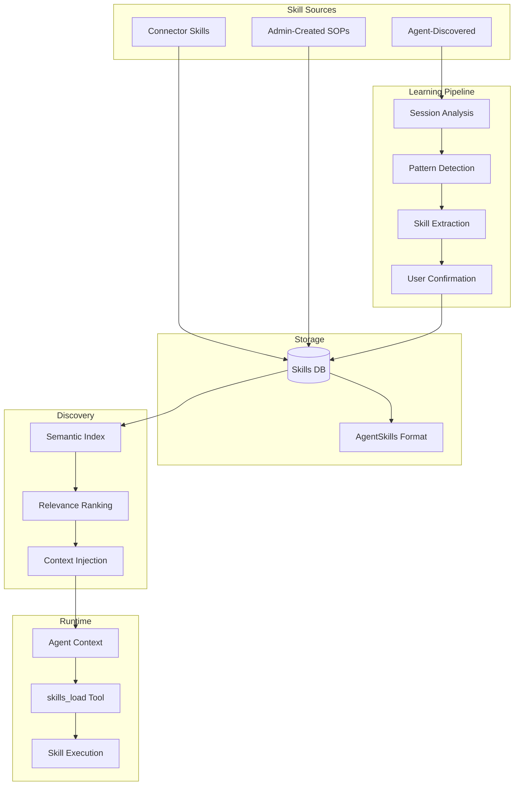
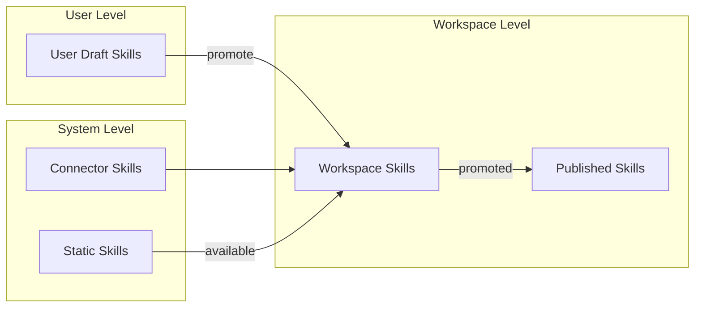

# Skill Learning System - Technical Specification

## Overview

A skill learning system for llmchain that enables agents to capture procedural knowledge from experience and reuse it across sessions. Skills follow the **AgentSkills.io standard** for interoperability.

## Decisions Made

### Decision 1.2: Skill Ownership Scope
**Made in**: [[rounds/01-foundation#Q1.2|Round 1, Q1.2]]

**Decision**: Hybrid model - users create personal skills, workspace promotes useful ones.

**Rationale** (from PRAXIS paper):
> "A naïve approach is a priori procedural specification: a human writes rules or SOPs included in the agent's context at inference time. In practice, this approach faces challenges because (1) many procedures are not fully documented; (2) enumerating all states and edge cases is difficult; (3) procedures can become obsolete quickly. A more robust approach is to learn procedures a posteriori from demonstrations or experience."

**Sources of skills**:
1. **Connector-bundled**: Platform-specific skills from connectors (Salesforce, Shopify)
2. **Admin-created**: Organization SOPs captured by workspace admins
3. **Agent-discovered**: Automatically learned from successful task completions

### Decision 1.3: Skill Learning Triggers
**Made in**: [[rounds/01-foundation#Q1.3|Round 1, Q1.3]]

**Decision**: Both C (agent proposes, user confirms) AND D (post-session batch analysis).

**Implementation**:
- During session: Agent can propose skills inline, user confirms via card UI
- Background: Batch analysis of successful sessions, presented in review queue

### Decision 1.4: Integration Approach
**Made in**: [[rounds/01-foundation#Q1.4|Round 1, Q1.4]]

**Decision**: Learned skills as "overlays" that can extend static skills. Leverage existing memory infrastructure.

### Decision 1.5: Skill Format Standard
**Made in**: [[rounds/01-foundation#Q1.5|Round 1, Q1.5]]

**Decision**: Follow [AgentSkills.io standard](https://agentskills.io/home).

**References**:
- https://github.com/anthropics/skills
- https://code.claude.com/docs/en/skills
- https://platform.claude.com/docs/en/agents-and-tools/agent-skills/best-practices

### Decision 1.6: Skill Discovery
**Made in**: [[rounds/01-foundation#Q1.6|Round 1, Q1.6]]

**Decision**: Hybrid - system suggests top-N relevant skills, agent/user confirms. Approach needs to adapt based on number of skills in workspace.

### Decision 1.8: UX Approach
**Made in**: [[rounds/01-foundation#Q1.8|Round 1, Q1.8]]

**Decision**:
- Dedicated skills section in UI (list/browse)
- Chat agent can respond with skill list when asked
- Simple markdown editor for skill content
- Inline cards for session-discovered skills
- Review queue for background-discovered skills

---

## Architecture

### High-Level Flow

### Skill Ownership Model

---

## Open Questions

- [x] Scope: Per-workspace vs per-user → **Hybrid** (Round 1)
- [x] Trigger: Explicit vs agent reflection → **Both C+D** (Round 1)
- [x] Format: Skill content structure → **AgentSkills.io standard** (Round 1)
- [x] Discovery: How to surface skills → **Hybrid with adaptation** (Round 1)
- [ ] Database schema: Exact table structure
- [ ] Memory integration: How to leverage existing memory system
- [ ] Embedding strategy: How to index skills for semantic search
- [ ] Background agent: Architecture for skill discovery agent

---

## Components (To Be Defined)

### Database Schema

*Defined in Round 2*

### Skill Store Interface

*Defined in Round 2*

### Learning/Extraction Logic

*TBD*

### Discovery/Retrieval

*TBD*

---

## Implementation Plan

### MVP Scope (Approved in Round 1)

- [ ] Database table for learned skills (per-workspace)
- [ ] `propose_skill` tool for agents to suggest skills
- [ ] Simple confirmation UI (inline in chat)
- [ ] Skills appear in agent's skill block alongside static skills
- [ ] Basic usage tracking (last_used_at, use_count)
- [ ] Simple management page (list, edit, delete)

### Not in MVP

- Semantic matching/embeddings (start with simple keyword matching)
- Per-user skills (start workspace-only)
- Skill versioning
- Automated quality scoring
- Cross-workspace sharing/marketplace
