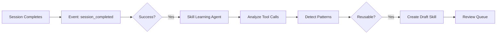

# Round 2: AgentSkills Standard & Architecture

> [!info] Building on
> This round builds on [[rounds/01-foundation|Round 1: Foundation]] decisions.

## Previous Round Summary

Key decisions from [[rounds/01-foundation|Round 1]]:

| Decision | Choice |
|----------|--------|
| **Ownership** | Hybrid: user creates, workspace promotes |
| **Triggers** | Both: agent proposes (C) + background analysis (D) |
| **Integration** | Overlays extending static skills, use memory infra |
| **Format** | AgentSkills.io standard |
| **Discovery** | Hybrid: system suggests, agent/user confirms |
| **UX** | Dedicated section + inline cards + review queue |

## This Round Focus

- Deep dive into AgentSkills.io standard format
- Design database schema for learned skills
- Define skill store interface
- Plan integration with existing llmchain systems

---

## Questions

### Q2.1: AgentSkills.io Standard - SKILL.md Format

**Context**: You mentioned following the [AgentSkills.io standard](https://agentskills.io). Based on the standard and Anthropic's implementation:

**Standard SKILL.md structure**:
```yaml
---
name: Skill Name
description: |
  Brief description of when to use this skill.
  Should help agent decide if this skill is relevant.
---

# Skill Name

## Instructions

Step-by-step procedural guidance...

## Examples

Example inputs and outputs...

## References

Links to additional resources...
```

**Key properties from the standard**:
| Property | Required | Description |
|----------|----------|-------------|
| `name` | ✅ | Human-readable skill name |
| `description` | ✅ | When to use (Tier 1 - always visible) |
| Body (instructions) | ✅ | How to execute (Tier 2 - loaded on demand) |

**Optional extensions for learned skills**:
| Property | Description |
|----------|-------------|
| `source` | `"learned"` \| `"static"` \| `"connector"` |
| `extends` | Parent skill key (for overlays) |
| `example_queries` | Sample user queries that trigger this skill |
| `created_by` | User/agent provenance |
| `workspace_id` | Ownership |

**Questions**:
1. Should we store skills in the exact SKILL.md format (markdown in DB) or parse into structured fields?
2. Do we need a `references/` subdirectory equivalent for learned skills?
3. How important is export/import compatibility with other AgentSkills implementations?

> [!note] Answer
>

---

### Q2.2: Database Schema Design

**Context**: We need to persist learned skills. Here's a proposed schema:

```sql
-- Core skills table
CREATE TABLE learned_skills (
  id UUID PRIMARY KEY DEFAULT gen_random_uuid(),
  workspace_id UUID NOT NULL,
  
  -- Identity (AgentSkills standard)
  key TEXT NOT NULL,                    -- e.g., "crm-enrichment-flow"
  name TEXT NOT NULL,                   -- "CRM Enrichment Flow"
  description TEXT NOT NULL,            -- Tier 1: when to use
  
  -- Content
  instructions TEXT NOT NULL,           -- Tier 2: markdown body
  example_queries TEXT[],               -- Sample triggers
  
  -- Relationships
  extends_skill TEXT,                   -- Parent skill key (overlay)
  suggested_tools TEXT[],               -- Tools commonly used
  
  -- Provenance
  source TEXT NOT NULL DEFAULT 'learned', -- 'learned' | 'admin' | 'connector'
  created_by_user_id UUID,
  created_by_session_id UUID,
  created_by_agent TEXT,
  
  -- Lifecycle
  status TEXT NOT NULL DEFAULT 'draft',  -- 'draft' | 'active' | 'archived'
  visibility TEXT NOT NULL DEFAULT 'workspace', -- 'user' | 'workspace'
  
  -- Quality signals
  use_count INTEGER DEFAULT 0,
  last_used_at TIMESTAMPTZ,
  success_count INTEGER DEFAULT 0,      -- Tasks completed successfully with skill
  feedback_score FLOAT,                 -- Aggregated user feedback
  
  -- Timestamps
  created_at TIMESTAMPTZ DEFAULT NOW(),
  updated_at TIMESTAMPTZ DEFAULT NOW(),
  
  UNIQUE (workspace_id, key)
);

-- Index for discovery
CREATE INDEX idx_learned_skills_workspace ON learned_skills(workspace_id, status);
CREATE INDEX idx_learned_skills_source ON learned_skills(source);

-- Skill references (optional attachments)
CREATE TABLE skill_references (
  id UUID PRIMARY KEY DEFAULT gen_random_uuid(),
  skill_id UUID REFERENCES learned_skills(id) ON DELETE CASCADE,
  
  path TEXT NOT NULL,                   -- e.g., "references/patterns.md"
  description TEXT NOT NULL,            -- Brief description
  content TEXT NOT NULL,                -- Markdown content
  
  created_at TIMESTAMPTZ DEFAULT NOW()
);
```

**Questions**:
1. Is this schema complete enough for MVP?
2. Should `example_queries` be a separate table for better querying/embeddings?
3. Do we need skill versioning (history table) in MVP?

> [!note] Answer
>

---

### Q2.3: Skill Store Interface

**Context**: Following llmchain patterns, we need a clean interface for skill operations.

```typescript
// packages/db/src/repositories/learned-skills/types.ts

export interface LearnedSkill {
  id: string
  workspaceId: string
  
  // AgentSkills standard
  key: string
  name: string
  description: string
  instructions: string
  
  // Extensions
  exampleQueries: string[]
  extendsSkill: string | null
  suggestedTools: string[]
  
  // Provenance
  source: 'learned' | 'admin' | 'connector'
  createdByUserId: string | null
  createdBySessionId: string | null
  createdByAgent: string | null
  
  // Lifecycle
  status: 'draft' | 'active' | 'archived'
  visibility: 'user' | 'workspace'
  
  // Quality
  useCount: number
  lastUsedAt: Date | null
  successCount: number
  feedbackScore: number | null
  
  // Timestamps
  createdAt: Date
  updatedAt: Date
}

export interface SkillProposal {
  name: string
  description: string
  instructions: string
  exampleQueries?: string[]
  suggestedTools?: string[]
  extendsSkill?: string
}

export interface SkillRepository {
  // CRUD
  create(workspaceId: string, proposal: SkillProposal, provenance: SkillProvenance): Promise<LearnedSkill>
  findById(id: string): Promise<LearnedSkill | null>
  findByKey(workspaceId: string, key: string): Promise<LearnedSkill | null>
  update(id: string, updates: Partial<LearnedSkill>): Promise<LearnedSkill>
  archive(id: string): Promise<void>
  
  // Discovery
  findActiveByWorkspace(workspaceId: string): Promise<LearnedSkill[]>
  findRelevant(workspaceId: string, query: string, limit?: number): Promise<LearnedSkill[]>
  
  // Quality tracking
  recordUsage(id: string, success: boolean): Promise<void>
  recordFeedback(id: string, helpful: boolean): Promise<void>
}
```

**Questions**:
1. Should `findRelevant` do semantic search or simple keyword matching for MVP?
2. Do we need batch operations (bulk create for connector skills)?
3. Should the interface support filtering by `source` or `status`?

> [!note] Answer
>

---

### Q2.4: Integration with Existing Skill Runtime

**Context**: llmchain's current skill system has:

```typescript
// Current: packages/ai-tool/src/skills/runtime/core.ts
export interface SkillState {
  allowed: ReadonlySet<string>
  active: ReadonlySet<string>
  isAllowed(key: string): boolean
  activate(key: string): SkillTier2 | null
  // ... more methods
}

// Current: packages/ai-tool/src/skills/generated/skills.gen.ts
export const skillMetadata: Record<SkillKey, SkillTier1> = { ... }
export const skillInstructions: Record<SkillKey, SkillTier2> = { ... }
```

**Integration options**:

**Option A: Extend SkillState to load learned skills**
```typescript
// In agent factory
const staticSkills = getStaticSkillMetadata()
const learnedSkills = await skillRepo.findActiveByWorkspace(workspaceId)
const allSkills = [...staticSkills, ...toSkillTier1(learnedSkills)]

const skillState = createSkillState({
  allowedSkills: allSkills,
  learnedSkillLoader: async (key) => skillRepo.findByKey(workspaceId, key)
})
```

**Option B: Separate learned skill handler**
```typescript
// Separate from static skills
const staticSkillState = createSkillState({ ... })
const learnedSkillState = createLearnedSkillState({
  workspaceId,
  repository: skillRepo
})

// Merge in prepareStep
const allTools = {
  ...createSkillTools(staticSkillState),
  ...createLearnedSkillTools(learnedSkillState),
  ...otherTools
}
```

**Option C: Unified skill registry**
```typescript
// New abstraction that wraps both
const skillRegistry = createSkillRegistry({
  static: staticSkillMetadata,
  learned: await skillRepo.findActiveByWorkspace(workspaceId),
  connectors: await connectorSkillRepo.findByWorkspace(workspaceId)
})

const skillState = createSkillState({ registry: skillRegistry })
```

**Which integration approach feels right?**

> [!note] Answer
>

---

### Q2.5: Skill Discovery & Context Injection

**Context**: From Round 1, we decided on hybrid discovery (system suggests, agent/user confirms). The challenge is balancing:
- **Relevance**: Surface skills likely to help
- **Context budget**: Don't bloat the prompt
- **Adaptability**: Handle workspaces with few vs many skills

**Proposed approach**:

```typescript
// In memory-injector.ts or similar
async function injectSkillContext(
  message: ModelMessage,
  options: {
    workspaceId: string
    userQuery: string
    activeStaticSkills: string[]
    maxLearnedSkills: number  // Configurable, e.g., 5
  }
): Promise<ModelMessage> {
  
  // 1. Get all active learned skills
  const allLearned = await skillRepo.findActiveByWorkspace(options.workspaceId)
  
  // 2. Score relevance (MVP: keyword matching, later: embeddings)
  const scored = allLearned.map(skill => ({
    skill,
    score: scoreRelevance(skill, options.userQuery)
  }))
  
  // 3. Take top N
  const topSkills = scored
    .sort((a, b) => b.score - a.score)
    .slice(0, options.maxLearnedSkills)
    .map(s => s.skill)
  
  // 4. Format as context block
  const skillsBlock = formatLearnedSkillsBlock(topSkills)
  
  // 5. Inject into message
  return {
    ...message,
    content: `${message.content}\n\n${skillsBlock}`
  }
}

function formatLearnedSkillsBlock(skills: LearnedSkill[]): string {
  if (skills.length === 0) return ''
  
  const entries = skills.map(s => 
    `<learned-skill key="${s.key}" name="${s.name}">\n${s.description}\n</learned-skill>`
  ).join('\n\n')
  
  return `<learned-skills hint="Use learned_skills_load to activate relevant skills">
${entries}
</learned-skills>`
}
```

**Questions**:
1. Should learned skills appear in the same `<skills>` block as static skills or separate?
2. What's a good default for `maxLearnedSkills`? 5? 10?
3. Should we include skill `useCount` or `successCount` in the context to help agent decide?

> [!note] Answer
>

---

### Q2.6: Skill Proposal Tool

**Context**: Agents need a way to propose new skills. Here's a draft tool:

```typescript
// In skill tools
export const proposeSkillTool = tool({
  description: 
    "Propose saving a reusable skill based on the workflow you just completed. " +
    "Use this when you've successfully completed a task that could be useful for future similar requests. " +
    "The user will be asked to confirm before the skill is saved.",
  inputSchema: z.object({
    name: z.string().describe("Human-readable skill name"),
    description: z.string().describe("When to use this skill (1-2 sentences)"),
    instructions: z.string().describe("Step-by-step procedure in markdown"),
    exampleQueries: z.array(z.string()).optional()
      .describe("Sample user queries that would trigger this skill"),
    suggestedTools: z.array(z.string()).optional()
      .describe("Tool names commonly used in this workflow"),
  }),
  execute: async (input, context) => {
    // Create draft skill
    const draft = await skillRepo.create(
      context.workspaceId,
      input,
      {
        source: 'learned',
        createdBySessionId: context.sessionId,
        createdByAgent: context.agentName,
        status: 'draft'  // Pending user confirmation
      }
    )
    
    // Signal to UI to show confirmation card
    return {
      success: true,
      skillId: draft.id,
      message: "Skill proposal created. Awaiting user confirmation.",
      uiAction: {
        type: 'skill_proposal',
        skillId: draft.id,
        name: input.name,
        description: input.description
      }
    }
  }
})
```

**Questions**:
1. Should agents be able to propose skills proactively, or only when asked?
2. How should the UI confirmation card look? (inline vs modal)
3. Should draft skills expire if not confirmed within N hours?

> [!note] Answer
>

---

### Q2.7: Memory Integration

**Context**: You mentioned leveraging the existing memory infrastructure. Current memory system:

```
packages/memory/
├── session-context/     # Cross-agent contributions
├── session-artifacts/   # Created artifacts
├── scratchpad/          # Per-agent working memory
└── previous-queries/    # Query history
```

**Potential integration points**:

**Option A: Skills as a new memory type**
```typescript
// New: packages/memory/src/learned-skills/
export interface LearnedSkillsSource extends ContextSource {
  // Loads top-N relevant skills into context
  getContext(workspaceId: string, query: string): Promise<ContextBlock>
}
```

**Option B: Skills in scratchpad**
```typescript
// Add to existing scratchpad
interface ScratchpadData {
  keyFindings: KeyFinding[]
  toolSummaries: ToolSummary[]
  activeSkills: string[]        // NEW: track which skills are loaded
  proposedSkills: SkillDraft[]  // NEW: skills being drafted
}
```

**Option C: Skills as artifacts**
```typescript
// Skills behave like artifacts (cross-session persistence)
interface SessionArtifact {
  artifactId: string
  kind: 'skill'              // NEW kind
  // ...
}
```

**Which integration approach aligns best with the memory architecture?**

> [!note] Answer
>

---

### Q2.8: Background Skill Discovery Agent

**Context**: From Round 1, we want background analysis of successful sessions. This could be a dedicated "skill learning agent" that:

1. Analyzes completed sessions asynchronously
2. Identifies reusable patterns
3. Proposes skills to review queue

**Architecture sketch**:



**Questions**:
1. How do we define "successful session"? Task completion? User satisfaction?
2. Should this be a cron job, event-driven, or manual trigger?
3. What heuristics indicate a reusable pattern?
   - Tool sequence repeated across sessions?
   - Multi-step workflows?
   - User explicitly praised the result?

> [!note] Answer
>

---

### Q2.9: Connector Skills

**Context**: You mentioned skills bundled with connectors (Salesforce, Shopify). How should these work?

**Option A: Static bundled skills**
```typescript
// In connector definition
const salesforceConnector = {
  id: 'salesforce',
  skills: [
    {
      key: 'salesforce:opportunity-pipeline',
      name: 'Salesforce Opportunity Pipeline',
      description: 'Query and analyze sales pipeline from Salesforce',
      instructions: '...'
    }
  ]
}
```

**Option B: Skills discovered from connector capabilities**
```typescript
// Auto-generate skills from connector operations
const connectorSkills = generateSkillsFromOperations(salesforceConnector.operations)
```

**Option C: Hybrid - bundled + user-customizable**
```typescript
// Connector provides base, user can create overlays
const baseSkill = salesforceConnector.skills.find(s => s.key === 'salesforce:pipeline')
const customSkill = {
  extends: 'salesforce:pipeline',
  instructions: '... plus our company-specific filters ...'
}
```

**How should connector skills work?**

> [!note] Answer
>

---

### Q2.10: MVP Implementation Order

**Context**: Based on all decisions, here's a proposed implementation sequence:

**Phase 1: Foundation** (Week 1)
1. Database schema + migrations
2. Skill repository interface + implementation
3. Basic CRUD API endpoints

**Phase 2: Runtime Integration** (Week 2)
4. Extend skill runtime to load learned skills
5. Implement `learned_skills_load` tool
6. Discovery/injection into agent context

**Phase 3: Learning** (Week 3)
7. `propose_skill` tool for agents
8. UI for skill confirmation (inline card)
9. Basic skill management page

**Phase 4: Quality** (Week 4)
10. Usage tracking
11. Feedback collection
12. Basic relevance scoring

**Does this sequencing make sense? Anything to reprioritize?**

> [!note] Answer
>

---

## Summary

This round explores the concrete architecture:

1. **AgentSkills.io format**: How to store/represent skills
2. **Database schema**: Tables and indexes
3. **Store interface**: Repository pattern
4. **Runtime integration**: How learned skills join static skills
5. **Discovery**: Context injection approach
6. **Proposal tool**: How agents suggest skills
7. **Memory integration**: Where skills fit in memory system
8. **Background agent**: Async skill discovery
9. **Connector skills**: Platform-bundled skills
10. **Implementation order**: MVP phases

**Next Steps**: After your responses, I'll finalize the technical spec and we can discuss Round 3 on skill extraction logic and quality mechanisms.

